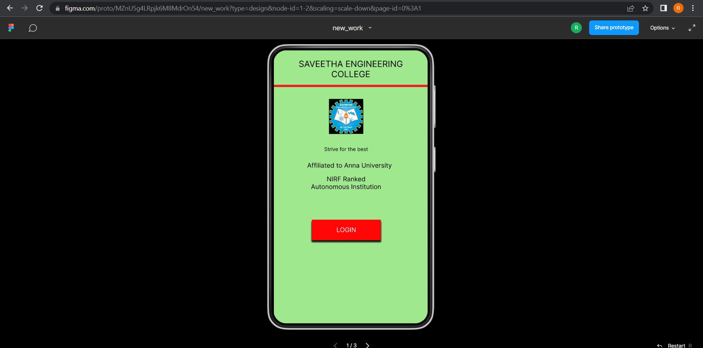
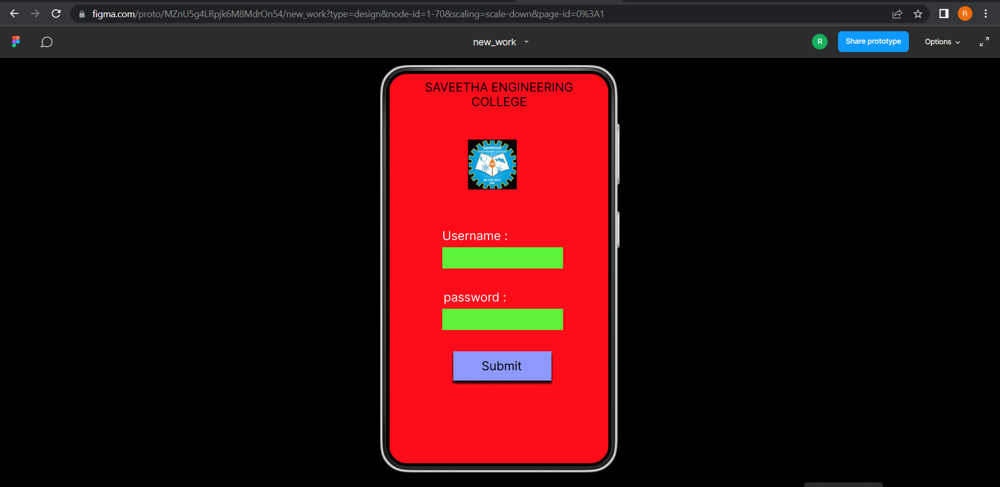
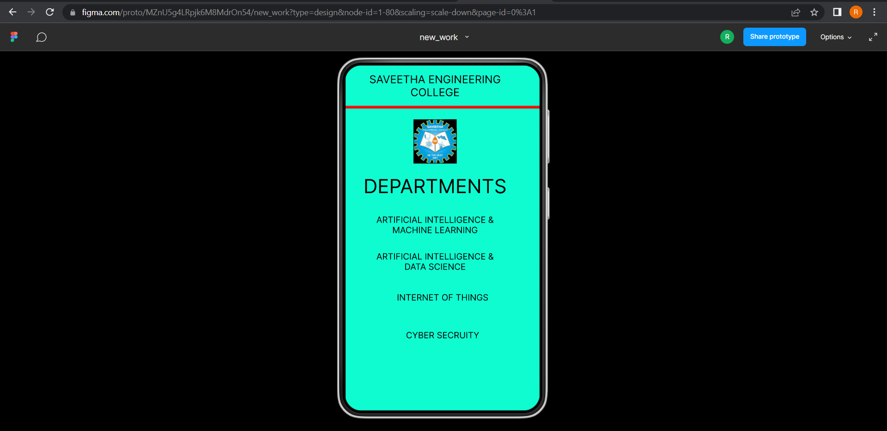

# Event Registration Web Application

## AIM:
To design, develop and deploy a web application for event registration.

## DESIGN STEPS:

### Step 1:
Create a new frame.

### Step 2:
Select any one preset size of your choice.

### Step 3:
Select the shapes you need.

### Step 4:
Import images as needed.

### Step 5:
Create pages based on your need and link them.

### Step 6:

Validate the HTML and CSS code.

### Step 6:

Publish the website in the given URL.

## DESIGN TOOL:
Figma

## code:
```
/* HOME PAGE */

position: relative;
width: 360px;
height: 640px;
background: #A0E88E;
box-shadow: 0px 4px 4px rgba(0, 0, 0, 0.25);


/* login page */

position: relative;
width: 360px;
height: 640px;
background: #FF0C1A;
box-shadow: 0px 4px 4px rgba(0, 0, 0, 0.25);


/* Line 2 */

position: absolute;
width: 360px;
height: 0px;
border: 5px solid #50F915;
box-shadow: 0px 4px 4px rgba(0, 0, 0, 0.25);


/* sec page */

position: relative;
width: 360px;
height: 640px;
background: #0FFCD1;
box-shadow: 0px 4px 4px rgba(0, 0, 0, 0.25);
```
## OUTPUT:






## RESULT:
The program to design, develop and deploy a web application for event registration is completed successfully.